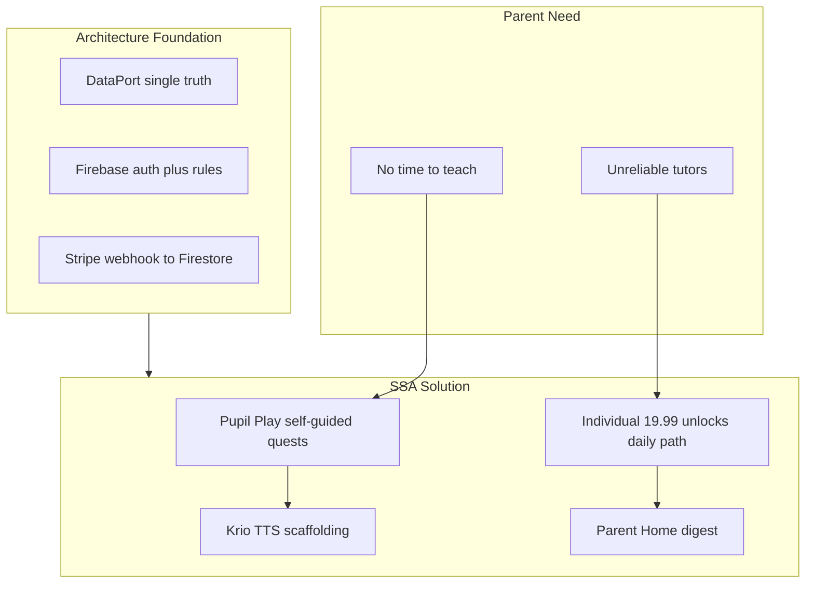
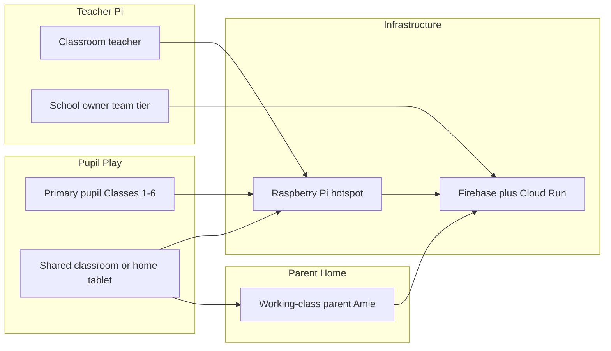
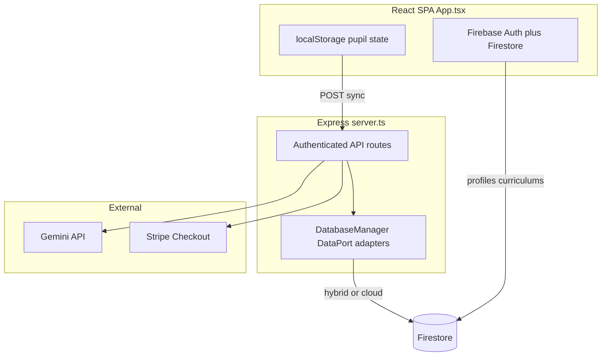
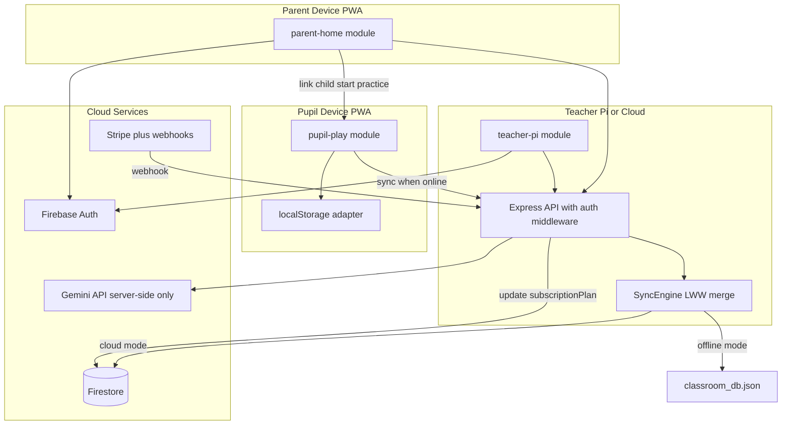
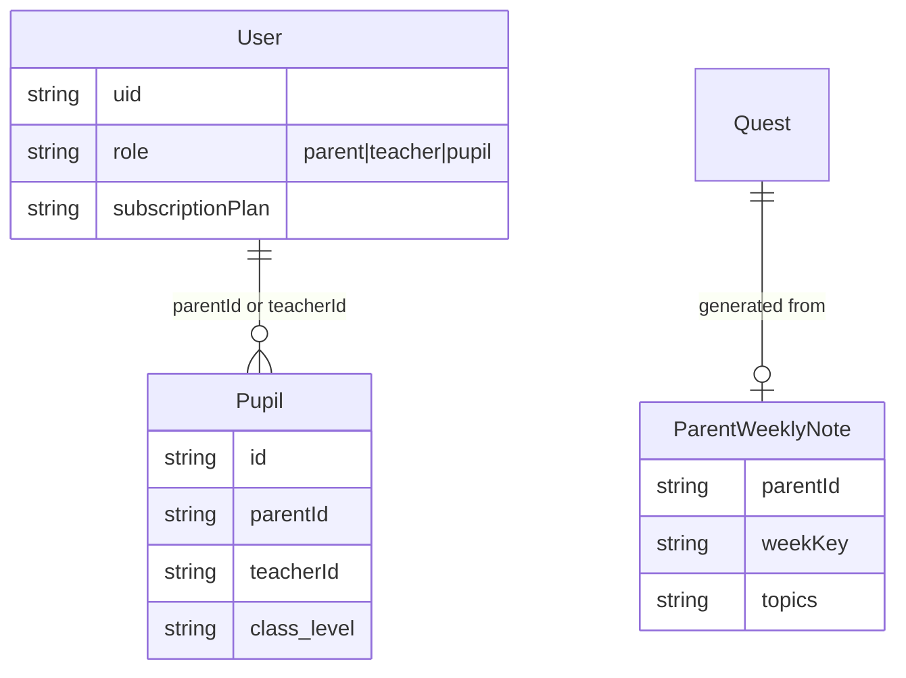

# Salone Stars Academy — Product Requirements & Architecture Document (PRD)

**Version:** 2.0  
**Date:** June 13, 2026  
**Status:** Draft for implementation approval  
**Methodology:** [BORIS.md](BORIS.md) — context-minimal briefs, verification loops, written rules in [CLAUDE.md](CLAUDE.md), phased delivery with adversarial security review

---

## 1. Executive Summary

**Salone Stars Academy (SSA)** is an offline-first, gamified LMS for Sierra Leonean primary pupils (Classes 1–6), aligned to the MBSSE national curriculum. It serves **three product modes** in one PWA:

- **Pupil Play** — local quiz gameplay, Krio voice scaffolding, streaks/badges, sync to classroom or home hub
- **Teacher Pi** — classroom hotspot hub, AI quest generation (Gemini), curriculum upload, leaderboard, Stripe premium billing
- **Parent Home** *(Phase 5)* — child profile linking, daily homework path, progress digest, Individual subscription for home learning

**Unified thesis:** SSA is not only a classroom Pi hub — it is a **home learning co-pilot** for busy working-class parents who lack time to re-teach school content or find reliable private tutors. The same offline-first quest engine powers classroom and home use, with architecture hardening (Phases 0–4) as the foundation and Parent Home (Phase 5) as the product expansion.

The product vision in [metadata.json](metadata.json) is sound. Phases 0–4 addressed the **implementation gap**: monolithic [src/App.tsx](src/App.tsx), dual data stores, unauthenticated APIs, billing disconnected from Firestore, and design system drift. Phase 5 delivers the **parent problem statement** on that hardened base.

**First-principles chain:** parent time scarcity → autonomous child practice (Krio TTS) → premium daily alignment → Individual **$19.99/mo** as home tutor replacement.

---

## 2. Problem Statements

### 2.1 Problem Statement 1 — Parent (user-facing)

> As a working-class parent, I do not have time to re-teach what school covered each day or help with homework. I also struggle to find a committed private tutor.

**Root needs (first principles):**

| Layer | Need | Why SSA can address it |
|-------|------|------------------------|
| **Time** | Zero parent teaching minutes per day | Child plays self-guided MBSSE quests with Krio TTS |
| **Trust** | Reliable, always-available help | PWA works offline; no tutor no-shows |
| **Alignment** | Practice matches what school teaches | MBSSE-aligned default quests + optional weekly topic input |
| **Accountability** | Know child is progressing without hovering | 2-minute parent digest (streak, subjects, weak areas) |
| **Affordability** | Cheaper than unreliable private tutoring | Individual **$19.99/mo** ≪ typical tutor cost |



### 2.2 Problem Statement 2 — Technical / architecture

| Pain | Impact |
|------|--------|
| Dual data stores with stubbed cloud mode | Teacher premium state, quests, and pupil sync can diverge |
| Unauthenticated `/api/*` routes | Anyone can inject leaderboard data, publish quests, trigger Gemini spend |
| Billing writes to local DB, not Firestore | Premium curriculum gate bypassed after real Stripe payment |
| 2,206-line `App.tsx` | Untestable, high re-render cost, blocks parallel agent work |
| Design tokens defined but inconsistently applied | Premium aesthetic undermined by inline Tailwind duplication |
| No automated tests | Boris Tip #1 (verification) cannot be satisfied |
| No parent role or home flow | Individual tier marketed to teachers only; parent pain unaddressed |

---

## 3. Users & Personas



### Primary personas

| Persona | Context | Core jobs |
|---------|---------|-----------|
| **Pupil** | Low-bandwidth classroom or home tablet; may be offline for days | Pick quest, answer MCQs, hear Krio guidance, earn stars/badges, sync progress |
| **Teacher** | Runs Pi hotspot or cloud dashboard | Monitor class, generate/publish MBSSE quests, upload curriculum (premium), view sync logs |
| **Parent (Amie)** | Shared phone/tablet; works long shifts; low bandwidth | Link child profile, set class level, subscribe Individual, glance at weekly progress, optionally note "what school taught this week" |
| **Private Tutor** | Solo educator (secondary Individual buyer) | Upload curriculum, generate/publish quests — same premium tier as parent, role-specific UX |
| **School Owner** | Team subscription | Multi-teacher ops (future), billing management |

### Individual $19.99 — dual audience (decided)

| Audience | Value proposition | Premium unlocks |
|----------|-------------------|-----------------|
| **Parent (primary)** | "Home Tutor Replacement" | Daily homework path, child profiles (max 3), AI homework quests from weekly topics |
| **Private tutor (secondary)** | "Private Lesson Toolkit" | Curriculum upload, AI quest publish, classroom leaderboard |

One Stripe price (`subscriptionPlan: "individual"`); role-specific UX via `UserProfile.role`; shared premium gate via `hasPremiumPlan()` in [firestore.rules](firestore.rules). No new Stripe price ID required.

### Non-goals

- Native iOS/Android apps (PWA is sufficient)
- Real-time multiplayer
- Full LMS (attendance, grading exports)
- Full parent portal in v1 — Phase 5 ships **Parent Home lite** (digest + child linking + daily path only)
- SMS/email digests, multi-parent households, native apps (Phase 5 non-goals)
- Replacing MBSSE official materials — SSA **aligns**, not replaces

---

## 4. Current State (As-Is)



**Phases 0–4 resolved (baseline for Phase 5):**

- Checkout uses `{ planName, email, userId }`; webhook updates Firestore `subscriptionPlan`
- Quest publish includes `subject`/`class_level`
- Express auth middleware on protected routes; Firestore rules hardened
- DataPort interface with LocalJson and Hybrid adapters
- Feature modules extracted under `src/features/`; shared UI components

**Remaining gap for parent problem:**

- `UserProfile.role` is `"teacher" | "pupil"` only — no `"parent"`
- [pricing-modal.tsx](src/features/billing/pricing-modal.tsx) targets private teachers, not parents
- No Parent Home module, child linking, daily path, or parent digest
- No `parentId` on pupil records or parent-scoped Firestore rules

---

## 5. Target Architecture (To-Be)

### 5.1 Architectural principles

1. **Offline-first, cloud-augmented** — Pupil gameplay works without network; sync is eventual
2. **Single source of truth per domain** — No duplicate quest/pupil/billing state
3. **Security at boundary** — Firestore rules for client; Firebase ID token middleware for server
4. **Design system as components** — Tokens in [src/index.css](src/index.css), not repeated inline classes
5. **Verification-first** — Every phase ships with `npm run lint` + manual E2E checklist + security spot-checks
6. **Thin parent shell** — Parent Home delegates to Pupil Play; no third monolith

### 5.2 Target system diagram



### 5.3 Deployment modes (single codebase)

| Mode | Trigger | Quests / pupils | Auth | Billing |
|------|---------|-----------------|------|---------|
| **Pi Offline** | No `FIREBASE_PROJECT_ID` | `classroom_db.json` | Optional local-only teacher session | Sandbox mock |
| **Pi + Cloud sync** | Env set, Pi runs Express | Local primary, Firestore backup | Firebase Auth | Stripe test/live |
| **Cloud-only** | Cloud Run deploy | Firestore primary | Firebase Auth | Stripe live |

Implementation: `DatabaseManager` delegates to **`DataPort`** ([src/data/ports.ts](src/data/ports.ts)) — LocalJsonAdapter and HybridDataAdapter.

### 5.4 Frontend module structure

```
src/
  app/
    app-shell.tsx              # flag stripe, tabs, layout shell
    providers.tsx              # auth, theme
  features/
    pupil-play/
      pupil-profile-card.tsx
      badges-cabinet.tsx
      sync-console.tsx
      quest-list.tsx
      quiz-view.tsx
      hooks/use-pupil-profile.ts
      hooks/use-quiz-engine.ts
    teacher-pi/
      teacher-auth-form.tsx
      classroom-leaderboard.tsx
      sync-log-console.tsx
      curriculum-uploader.tsx
      quest-generator.tsx
      hooks/use-teacher-metrics.ts
    parent-home/               # Phase 5
      parent-auth-form.tsx
      child-profile-linker.tsx
      progress-digest.tsx
      daily-path-card.tsx
      weekly-topic-form.tsx
      hooks/use-parent-children.ts
      hooks/use-daily-path.ts
    billing/
      pricing-modal.tsx        # role-aware copy
      hooks/use-billing.ts
  lib/
    tts.ts
    subject-colors.ts
    api-client.ts
  shared/
    ui/
  types.ts
  firebase.ts
  firebaseDb.ts
```

**Boris alignment:** Each feature folder is an isolated worktree/workflow unit. Phase 5 parallel worktrees: `wt-parent-ui`, `wt-parent-api`, `wt-billing-copy`.

### 5.5 Design system compliance ([DESIGN_SYSTEM_REFERENCE.md](DESIGN_SYSTEM_REFERENCE.md))

| Token / pattern | Required usage |
|-----------------|----------------|
| `glass-card-dark` | All content cards via `<GlassCard>` |
| `brand-primary` `#075fe8` | Primary CTAs via `<PrimaryButton>` |
| `desktop-flow-line` / `mobile-flow-line` | Background via `<AppBackground>` |
| `accent-border-gradient` | Section dividers via `<SectionDivider>` |
| Poppins 400/600, JetBrains Mono | Typography |
| Sierra Leone flag stripe | Brand identity — retain as SSA extension |
| Krio microcopy | Parent digest helper strings (Phase 5) |

---

## 6. Functional Requirements

### 6.1 Pupil Play (P0) — Completed

| ID | Requirement | Acceptance criteria |
|----|-------------|---------------------|
| P-01 | Select quest filtered by `class_level` | Only matching quests shown; completed quests marked |
| P-02 | MCQ quiz with Krio TTS | `krioInstruction` spoken via Web Speech API; toggle in UI |
| P-03 | Scoring + streaks | +20 stars per correct; streak increments; wrong shows explanation |
| P-04 | Badge awards | Subject-based badges unlock once; no duplicates after sync |
| P-05 | Offline persistence | Profile, completed quests, unsynced points survive refresh |
| P-06 | Sync to hub | POST `/api/sync` clears `unsyncedPoints`; leaderboard updates |
| P-07 | Streak freeze purchase | Deduct stars; increment `streak_freezes` |

### 6.2 Teacher Pi (P0) — Completed

| ID | Requirement | Acceptance criteria |
|----|-------------|---------------------|
| T-01 | Email/password auth | Firebase Auth; Firestore profile with `subscriptionPlan: "free"` |
| T-02 | Classroom leaderboard | Sorted by points; podium top 3 |
| T-03 | Sync log console | Last 50 events; JetBrains Mono styling |
| T-04 | AI quest generation | Gemini returns valid JSON; loading states |
| T-05 | Quest publish | Quest appears in pupil list after publish + refresh |
| T-06 | Premium curriculum upload | Blocked on free tier; upload/list/delete on individual/team |
| T-07 | Remove demo credential bypass | No hardcoded passwords in client bundle |

### 6.3 Billing (P1) — Completed + Phase 5 extensions

| ID | Requirement | Acceptance criteria | Status |
|----|-------------|---------------------|--------|
| B-01 | Stripe Checkout | Individual $19.99/mo, Team $99.99/mo | Done |
| B-02 | Webhook-driven plan update | `checkout.session.completed` updates Firestore `users/{uid}.subscriptionPlan` | Done |
| B-03 | Success redirect handling | App reads `?billing-success=true`, refreshes profile from Firestore | Done |
| B-04 | Remove client-side premium bypass | No local state mutation for premium | Done |
| B-05 | Sandbox fallback | `/_mock-payment` only when `STRIPE_SECRET_KEY` absent | Done |
| B-06 | Individual tier dual-audience | Same `individual` plan activates parent Daily Path OR teacher curriculum upload based on `role` | Phase 5 |
| B-07 | Parent-oriented Stripe line item | Checkout description: "Home learning support — daily MBSSE-aligned practice" when `role === "parent"` | Phase 5 |
| B-08 | Downgrade behavior | `customer.subscription.deleted` disables Daily Path + AI homework; child retains free MBSSE quests | Phase 5 |
| B-09 | Household limit | Individual parent plan: max 3 linked children (`MAX_PARENT_CHILDREN` constant) | Phase 5 |

#### Billing implementation notes (Individual $19.99 dual-audience)

| Area | Current | Target (Phase 5) |
|------|---------|------------------|
| [src/types.ts](src/types.ts) `UserProfile.role` | `"teacher" \| "pupil"` | Add `"parent"` |
| [pricing-modal.tsx](src/features/billing/pricing-modal.tsx) | "Popular for Private Teachers" | Role-aware: parent default ("Home Tutor Replacement"); teacher variant when `role === "teacher"` |
| [server.ts](server.ts) checkout metadata | `{ userId, plan }` | Add `subscriberRole: parent \| teacher` for Stripe analytics |
| [firebase-blueprint.json](firebase-blueprint.json) | teacher/pupil only | Extend User enum; add `parentId` on Pupil |
| Premium feature gates | Curriculum upload (teacher) | Parents: Daily Path + child profiles + AI homework; Teachers: curriculum upload + classroom publish |

### 6.4 Sync engine (P0) — Completed

| ID | Requirement | Acceptance criteria |
|----|-------------|---------------------|
| S-01 | Field-level merge | `points`, `streak_count`: max; `badges_earned`: set union |
| S-02 | Monotonic dates | Reject `last_active_date` older than stored |
| S-03 | Idempotent sync | Same payload twice does not double-count `delta_points` |
| S-04 | Auth on sync endpoint | Pi mode: classroom PIN or device token; Cloud: Firebase token |

**Phase 5 extension:** Home-only pupils use `parentId` as sync authority (mirror `teacherId` classroom pattern).

### 6.5 Parent Home (P1 — Phase 5)

| ID | Requirement | Acceptance criteria |
|----|-------------|---------------------|
| PA-01 | Parent registration | Firebase Auth; profile created with `role: "parent"`, `subscriptionPlan: "free"` |
| PA-02 | Child profile linking | Parent creates 1–3 child profiles (`parentId` on pupil record); each gets Pupil Play local UUID |
| PA-03 | Class level + subject focus | Parent sets `class_level` (Class 1–6); optional weekly topic note (text, max 500 chars) |
| PA-04 | Daily homework path (premium) | Individual subscribers see 1 recommended quest/day filtered by class + recent topics; free tier sees MBSSE defaults only |
| PA-05 | Parent progress digest | Card: streak, points this week, subjects attempted, last active; no quiz UI for parent |
| PA-06 | One-tap "Start child's practice" | Deep-links to Pupil Play with selected child profile |
| PA-07 | Individual checkout from Parent Home | Stripe checkout with parent-oriented copy; success refreshes Firestore profile |
| PA-08 | Offline home use | Child quests + progress persist locally; sync when online via `/api/sync` with `parentId` |
| PA-09 | Weekly topic → quest (premium, server) | `POST /api/parent/generate-homework` (Gemini, rate-limited 5/day/parent) converts topic note into 1 quest draft; parent approves before child sees it |
| PA-10 | Krio microcopy for low-literacy parents | Digest labels in English + short Krio helper text |

**Reuse:** PA-04/PA-06 delegate to [use-pupil-profile.ts](src/features/pupil-play/hooks/use-pupil-profile.ts) and quiz engine — Parent Home is a thin shell.

---

## 7. Non-Functional Requirements

| Category | Requirement |
|----------|-------------|
| **Performance** | Quest list renders < 200ms on Pi 4; quiz transition < 100ms |
| **Offline** | Full pupil quiz loop without network |
| **Accessibility** | Keyboard-navigable MCQ options; `aria-label` on icon buttons; focus rings via `shadow-focus-glow` |
| **Localization** | Krio instructional copy in questions; English UI labels; Krio helper strings on parent digest |
| **PWA** | [public/manifest.json](public/manifest.json) standalone; [public/sw.js](public/sw.js) bypasses `/api/*` cache |
| **Observability** | Structured logs on sync/billing/Gemini; `GET /health` endpoint |
| **Build** | `npm run build` produces `dist/` + `dist/server.cjs`; `npm run lint` passes |
| **Time-to-value (parent)** | Parent onboarding → child first quest in < 3 minutes |
| **Attention budget (parent)** | Parent digest readable in < 2 minutes |
| **Child autonomy** | 90% of session time is child-only (no parent login required mid-quest) |
| **Privacy** | Parent reads only linked children; COPPA-aligned: no child email required |
| **Cost control** | Parent Gemini homework capped at 5/day (vs teacher 10/hr) |
| **Offline (parent)** | Daily path cached locally; stale banner if > 7 days offline |

---

## 8. Security Requirements ([security_spec.md](security_spec.md))

### 8.1 Data invariants (must hold in production)

1. Teachers own their `users/{uid}` document; pupils linked via `teacherId` and/or `parentId`
2. `subscriptionPlan` / `stripeCustomerId` updated **only** via Stripe webhook Admin SDK — not client `updateProfile`
3. Premium curriculum requires `hasPremiumPlan()` for teachers; Daily Path + AI homework require `hasPremiumPlan()` for parents
4. Server time authority for temporal fields (`request.time` in rules; server timestamp on sync)
5. Parents read/update only pupils where `parentId == request.auth.uid`

### 8.2 Dirty Dozen remediation map

| # | Threat | Fix |
|---|--------|-----|
| 1 | Self-service premium | Block client billing field writes; webhook-only updates via Admin SDK |
| 3 | Oversized pupil ID | Apply `isValidId()` in `pupils` rules |
| 4 | Leaderboard spoofing | Authenticate `/api/sync`; bind pupil to classroom or parent session |
| 5 | Stripe hijack | Remove owner-writable `stripeCustomerId` from client update path |
| 6 | Date backtracking | Monotonic `last_active_date` in sync merge + Firestore rule |
| 9 | Duplicate badges | Dedupe on merge server-side |
| 10 | Foreign pupil listing | Teacher-scoped queries; no global pupil list |

### 8.3 Parent-specific security (Phase 5)

| Threat | Fix |
|--------|-----|
| Parent reads unrelated pupils | Firestore: `pupil.parentId == request.auth.uid` on get/update |
| Parent generates quests for other children | `/api/parent/generate-homework` validates linked `pupilId` |
| Parent self-upgrade | Unchanged — webhook-only `subscriptionPlan` |
| Child links to wrong parent | v1: parent auth required to create link; v2: server-generated invite code |
| Child accesses Parent Home | Role guard redirects to Pupil Play |

### 8.4 Express API hardening

- `verifyFirebaseToken` middleware for `/api/teacher/*`, `/api/billing/*`, `/api/parent/*`
- Rate-limit `/api/teacher/generate-quest` (10/hour/teacher)
- Rate-limit `/api/parent/generate-homework` (5/day/parent)
- Restrict CORS to `APP_URL` origin in production

---

## 9. Edge Cases

| Edge case | Behavior |
|-----------|----------|
| Child in school + home (dual linkage) | Pupil has both `teacherId` and `parentId`; LWW merge on sync; parent digest reads merged state |
| Two parents, one child | v2 defer; v1: single `parentId` owner |
| Parent cancels mid-month | Premium until period end (Stripe); then revert to free daily defaults |
| Payment fails / card declined | Webhook `invoice.payment_failed` → banner in Parent Home; 3-day grace before downgrade |
| Shared device, multiple children | Profile picker on Pupil Play launch; separate localStorage keys per child |
| Child changes class mid-year | Parent updates `class_level`; daily path recalculates; completed quests retained |
| Offline 30+ days | Show "sync when online" banner; local progress preserved |
| Parent enters gibberish weekly topic | Gemini validation rejects; show friendly retry message |
| Parent and teacher both Individual | Allowed (separate accounts); no double-charging same Firebase uid |
| Tutor uploads curriculum, parent uses defaults | Independent premium paths per role |
| Low phone storage | Quest cache cap (e.g., 50 quests); LRU eviction |
| Child tries to access Parent Home | Role guard redirects to Pupil Play |
| Duplicate pupil UUID across devices | Sync LWW; warn parent if name/class conflict detected |
| Gemini outage | Fall back to MBSSE default quest for the day; no blocking error |
| Parent exceeds 3-child limit | Block new link; prompt upgrade messaging (Team tier future) |

---

## 10. Data Model

Single type source: [src/types.ts](src/types.ts). Canonical schema: [firebase-blueprint.json](firebase-blueprint.json).



**Domain ownership:**

| Entity | Pi offline | Cloud | Writer |
|--------|-----------|-------|--------|
| `Quest` | local JSON | Firestore `quests/` | Teacher publish; parent-approved AI homework |
| `Pupil` sync state | local JSON | Firestore `pupils/` | Sync engine |
| `User` | n/a | Firestore `users/` | Auth + Stripe webhook |
| `Curriculum` | n/a | Firestore `curriculums/` | Premium teacher |
| `ParentWeeklyNote` | n/a | Firestore `parent_notes/` | Premium parent |

**Phase 5 Firestore additions:**

- `users/{uid}.role` enum extended with `"parent"`
- `pupils/{id}.parentId` optional (home-only or dual-linked pupils)
- `parent_notes/{parentId}_{weekKey}` — weekly topic input for AI homework
- Rules: parent CRUD on own notes; parent read/update linked pupils only

---

## 11. Boris Execution Framework

This PRD is executed using [BORIS.md](BORIS.md) patterns:

### 11.1 Context-minimal brief template (per phase)

Every implementation task starts with:

- **Goal:** What success looks like
- **Constraints:** Files not to touch; non-goals
- **Acceptance criteria:** Commands + manual checks
- **Verification:** `npm run lint`, manual E2E script

### 11.2 Write-it-down rule

After each phase, update [CLAUDE.md](CLAUDE.md) with:

- New module paths
- Auth middleware usage
- Parent role pitfalls (e.g., never call `updateProfile` for `subscriptionPlan`; max 3 children on Individual)

### 11.3 Verification loop (Tip #1)

| Script | Purpose |
|--------|---------|
| `scripts/verify-sync.mjs` | POST sample sync, assert leaderboard |
| `scripts/verify-publish.mjs` | Generate + publish quest, assert in GET `/api/quests` |
| `scripts/verify-parent-flow.mjs` *(Phase 5)* | Register parent → link child → checkout mock → daily path visible |
| Firestore rules unit tests | `@firebase/rules-unit-testing` — Dirty Dozen + parent scope |

### 11.4 Parallel worktree strategy

| Worktree | Scope | Status |
|----------|-------|--------|
| `wt-security` | API auth, Firestore rules, billing webhook | Completed |
| `wt-refactor-ui` | App.tsx extraction + design system | Completed |
| `wt-data-layer` | DataPort adapter, cloud mode | Completed |
| `wt-parent-ui` | Parent Home module | Phase 5 |
| `wt-parent-api` | generate-homework endpoint + Firestore rules | Phase 5 |
| `wt-billing-copy` | Role-aware pricing modal | Phase 5 |

Merge order: security → data layer → UI refactor → parent (Phase 5).

### 11.5 Dynamic workflow trigger

For Parent Home implementation, invoke **"use a workflow"** pattern:

- Orchestrator: define module boundaries and role gates
- Implementers: one agent per worktree above
- Verifier: `npm run lint` + `verify-parent-flow.mjs` + visual spot-check
- Fixer: address lint/type errors

---

## 12. Phased Delivery Roadmap

### Phase 0 — Stabilize (1 week) `[Completed]`

**Goal:** Fix broken flows without architectural rewrites.

- Fix checkout field names (`planName`, `email`)
- Merge `subject`/`class_level` into publish payload
- Handle `billing-success` query in App
- Remove demo credentials and client premium bypass
- Add `GET /health`

**Verification:** Manual checkout sandbox → profile shows premium in Firestore; publish quest → appears in pupil list.

### Phase 1 — Security & billing (1–2 weeks) `[Completed]`

**Goal:** Close Dirty Dozen gaps; wire Stripe properly.

- Firebase Admin SDK in server for webhook handler
- Stripe webhook: `checkout.session.completed`, `customer.subscription.deleted`
- Express auth middleware on protected routes
- Tighten [firestore.rules](firestore.rules)
- Remove owner-writable Stripe fields from client rules

**Verification:** Dirty Dozen invalidation payloads against rules emulator — all 12 PERMISSION_DENIED.

### Phase 2 — Data layer unification (2 weeks) `[Completed]`

**Goal:** Single `DataPort`; cloud mode no longer stubbed.

- Define `DataPort` interface in `src/data/ports.ts`
- Implement `LocalJsonAdapter` and `HybridDataAdapter`
- Mode selection via env (`DEPLOYMENT_MODE=pi|cloud|hybrid`)

**Verification:** Same API responses in Pi and cloud modes; sync idempotency script passes.

### Phase 3 — Frontend modularization (2–3 weeks) `[Completed]`

**Goal:** Decompose App.tsx into feature modules; adopt design system components.

- Extract components under `src/features/`
- Create `shared/ui/` glass card, button, divider, background
- Domain hooks: `usePupilProfile`, `useQuizEngine`, etc.

**Verification:** `npm run lint`; no file > 400 lines in `src/features/`; visual parity.

### Phase 4 — Quality & ops (1 week) `[Completed]`

**Goal:** Production readiness.

- Rate limiting + Gemini cost caps
- Error boundaries
- Update DESIGN_SYSTEM_REFERENCE.md and README

**Verification:** Full E2E checklist (pupil quiz → sync → teacher leaderboard → AI quest → publish → premium curriculum).

### Phase 5 — Parent Home (2 weeks) `[NEW]`

**Goal:** Deliver parent problem statement MVP on hardened architecture.

**Constraints:**

- Reuse Pupil Play — no duplicate quiz engine
- One Stripe Individual price — role-aware UX only
- No SMS/email digests; no multi-parent households

**Scope:**

- Extend `UserProfile.role` + parent registration flow
- `src/features/parent-home/` — digest, child linking, daily path, weekly topic form
- Role-aware [pricing-modal.tsx](src/features/billing/pricing-modal.tsx) + checkout `subscriberRole` metadata
- Firestore rules for `parentId` and `parent_notes`
- `POST /api/parent/generate-homework` (premium, rate-limited 5/day)
- `scripts/verify-parent-flow.mjs`
- Handle `invoice.payment_failed` grace banner (B-08)

**Acceptance criteria:**

- Parent signup → link child → free daily quest visible
- Individual checkout → Daily Path + AI homework unlocked
- Child completes quest offline → parent digest updates on sync
- Teacher Individual flow unchanged

**Verification:** `npm run lint`; `node scripts/verify-parent-flow.mjs`; manual E2E checklist above.

**Non-goals:** SMS/email digests, multi-parent households, native apps, new Stripe price tier.

---

## 13. Success Metrics

| Metric | Target |
|--------|--------|
| Pupil sync success rate | > 99% on classroom LAN |
| Quest publish failure rate | < 1% |
| Time to first quiz (cold start) | < 3s on Pi 4 |
| Premium conversion tracking | Stripe dashboard + Firestore plan field match 100% |
| Security spec compliance | 12/12 Dirty Dozen blocked |
| Max component file size | < 400 lines in `src/features/` |
| Design system token usage | > 90% cards use `<GlassCard>` |
| Parent onboarding completion | > 70% reach first child quest |
| Daily path engagement (Individual) | > 4 days/week active |
| Parent digest open rate | > 50% weekly |
| Individual conversion (parent-led) | Track via `subscriberRole` Stripe metadata |
| Time parent spends in app | < 5 min/week (validates "no time" promise) |

---

## 14. Risks & Dependencies

| Risk | Mitigation |
|------|------------|
| Pi hardware constraints | Keep pupil path offline; lazy-load teacher/parent AI panels |
| Gemini API cost | Server-side rate limits; parent 5/day vs teacher 10/hr |
| Firestore rules complexity | Rules unit tests in CI; parent scope tests in Phase 5 |
| Stripe webhook delivery | Idempotent webhook handler + retry logging |
| Parent confusion (teacher vs parent tier) | Role-aware pricing copy; separate onboarding paths |
| Dual linkage sync conflicts | LWW merge with monotonic dates; document in CLAUDE.md |
| Low connectivity at home | Offline-first unchanged; stale banner after 7 days |
| Low literacy parents | Krio helper microcopy on digest CTAs |

**Dependencies:** Firebase Auth (Email/Password enabled), `GEMINI_API_KEY`, `STRIPE_SECRET_KEY`, [firebase-applet-config.json](firebase-applet-config.json)

---

## 15. Open Decisions (for stakeholder sign-off)

1. **Pupil auth model:** Stay anonymous local UUID vs Firebase pupil accounts linked to teacher/parent
2. **Pi classroom auth:** Shared PIN vs per-device tokens for `/api/sync`
3. **IndexedDB migration:** Replace localStorage for larger offline payloads
4. **Team tier scope:** Multi-teacher org features deferred or included post-Phase 5?
5. **Parent-child invite codes:** Server-generated codes for v2 dual-parent or school linkage?
6. **SMS/email digest timing:** Weekly summary channel (Orange SL, WhatsApp) — post-Phase 5
7. **Payment failure grace period:** 3-day default — confirm with Stripe billing settings

---

## 16. Appendix — Key files reference

| File | Role |
|------|------|
| [PRD.md](PRD.md) | This document |
| [src/App.tsx](src/App.tsx) | App shell orchestration |
| [server.ts](server.ts) | API + billing + Gemini |
| [src/dbManager.ts](src/dbManager.ts) | DatabaseManager + DataPort delegation |
| [src/data/ports.ts](src/data/ports.ts) | DataPort interface |
| [src/firebaseDb.ts](src/firebaseDb.ts) | Client Firestore CRUD |
| [src/features/billing/pricing-modal.tsx](src/features/billing/pricing-modal.tsx) | Role-aware pricing (Phase 5) |
| [src/features/parent-home/](src/features/parent-home/) | Parent Home module (Phase 5) |
| [firestore.rules](firestore.rules) | Security boundary |
| [security_spec.md](security_spec.md) | Threat model |
| [src/index.css](src/index.css) | Design tokens |
| [DESIGN_SYSTEM_REFERENCE.md](DESIGN_SYSTEM_REFERENCE.md) | Design spec |
| [BORIS.md](BORIS.md) | Execution methodology |
| [CLAUDE.md](CLAUDE.md) | Agent context (update each phase) |
